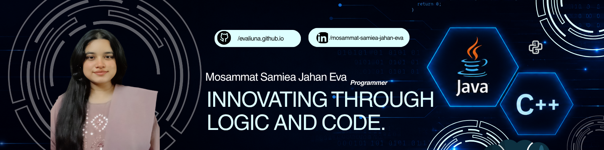

<div align="center">

  <a href="https://evaliuna.github.io/PORTFOLIO-1.0/">
    
  </a>
  &nbsp;
  <a href="https://www.linkedin.com/in/samiea-jahan-eva-383678274/">
    
  </a>
  &nbsp;
  

</div>

<br>
<br>

---


## 👋 Hi, I'm Eva

I'm a **CSE student at Daffodil International University** on a structured path toward becoming a **Full Stack Software Engineer**. I'm building my foundation layer by layer — sharpening problem-solving with C++, learning Java for enterprise backend development, and working through a 6-phase Full Stack roadmap that takes me from Web Foundations all the way to DevOps & Deployment.


---

<br>
<br>

## 🗺️ My Learning Roadmap

I'm following a structured **Java Full Stack path** (6 phases) while building my problem-solving muscle in parallel.

```
CURRENT FOCUS
├── 🔢 C++ DSA          → Daily problem solving to build algorithmic thinking
└── 🌐 Phase 01         → Web Foundations (HTML · CSS · JavaScript · Git)

UP NEXT
├── ⚛️  Phase 02         → Frontend with React (component-driven UIs)
└── ☕  Phase 03         → Core Java (OOP · Collections · Streams · Multithreading)

LATER
├── 🔧 Phase 04         → Spring Boot + REST APIs
├── 🗄️  Phase 05         → Databases & ORM (MySQL · PostgreSQL · Hibernate · Redis)
└── 🚀 Phase 06         → DevOps & Deployment (Docker · CI/CD · AWS)
```

> **Why C++ alongside Java?** C++ forces you to think at a lower level — memory, efficiency, logic. That sharpness transfers directly into better Java and better system design thinking down the road.


---
<br>
<br>

## 🛠️ Tech Stack

**Languages**

<p>
  &nbsp;&nbsp;
  &nbsp;&nbsp;
  
</p>

**Frontend & UI**

<p>
  &nbsp;&nbsp;
  &nbsp;&nbsp;
  &nbsp;&nbsp;
  &nbsp;&nbsp;
  
</p>

**Tools & Version Control**

<p>
  &nbsp;&nbsp;
  &nbsp;&nbsp;
  
</p>

**Coming Soon** *(Phase 04–06)*

<p>
  &nbsp;&nbsp;
  &nbsp;&nbsp;
  &nbsp;&nbsp;
  &nbsp;&nbsp;
  
</p>


---
<br>
<br>

## 🎯 2026 Goals

| Area | Goal | Status |
|------|------|--------|
| 🔢 Problem Solving | Solve 100+ DSA problems in C++ | 🔄 In Progress |
| 🌐 Web Foundations | Complete Phase 01 — HTML, CSS, JS, Git | 🔄 In Progress |
| ⚛️ React | Complete Phase 02 of roadmap | 📅 Planned |
| ☕ Java | Complete Phase 03 — Core Java | 📅 Planned |
| 🛠️ Projects | Publish 3+ original projects on GitHub | 📅 Planned |
| 🤝 Open Source | Make my first open-source contribution | 📅 Planned |
| 💼 Career | Land my first internship or dev role | 🎯 Target |


---

<br>
<br>

## 📊 GitHub Stats


<br/>

<div align="left">
  
</div>

<br/>

<div align="left">
  
</div>


---

<br>
<br>

## 🏆 Profile Summary
[](https://github.com/vn7n24fzkq/github-profile-summary-cards)

<br>
<br>


## ✍️ Random Dev Quote
<p align="center">
  
</p>


<div align="center">
  <sub>
    Thanks for stopping by! I'm always open to connecting, collaborating, or just talking tech. 
    <br/>
    <br/>
    <a href="https://www.linkedin.com/in/samiea-jahan-eva-383678274/">
      
    </a>
  </sub>
</div>
